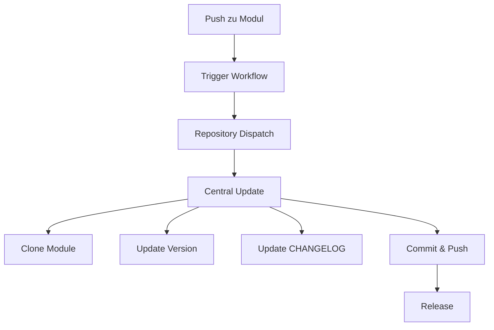

# 🔄 Ez Chajim Auto-Update System

**Stand: 12. Tammus 5785, MESZ**

Zentrales Auto-Update System für alle Ez Chajim Module mit WWAQ-konformer Sprachvalidierung und hebräischer Versionierung.

## 🌟 Features

- **🔄 Automatische Updates**: Täglich um 3:00 UTC
- **📦 Dependency Management**: Intelligente Update-Reihenfolge
- **🏷️ Hebräische Versionierung**: Format `5785.MM.TT`
- **✅ WWAQ-Konformität**: K→Q Transformation, Zer-Elimination
- **🔔 Trigger-System**: Updates bei jedem Push
- **📊 Parallel Processing**: Alle Module gleichzeitig
- **📝 Changelog-Updates**: Automatische Dokumentation

## 📚 Verwaltete Module

| Modul | Typ | Beschreibung |
|-------|-----|--------------|
| `ez-chajim-hns10-core` | Core | HNS10 Spiralzeit-System |
| `ez-chajim-manuscript-proc` | Library | Manuskript-Verarbeitung |
| `ez-chajim-yaml-formatter` | Library | YAML-Strukturierung |
| `ez-chajim-wwaq-validator` | Library | WWAQ-Sprachvalidierung |
| `ez-chajim-lkv-visualizer` | App | Lebendiger Körper Visualisierung |
| `ez-chajim-quantum-sync` | Service | Quanten-Synchronisation |
| `ez-chajim-intelli-chunk` | App | Intelligenter Text-Chunker |

## 🚀 Verwendung

### Automatische Trigger

Jedes Modul hat einen Trigger-Workflow der bei Push aktiviert wird:

```yaml
# In jedem Modul: .github/workflows/trigger-update.yml
name: Trigger Auto-Update
on: push
```

### Manueller Start

1. Gehe zu [Actions](https://github.com/JEREMIA1964/ez-chajim-auto-update/actions)
2. Wähle "Update All Ez Chajim Modules"
3. Klicke "Run workflow"
4. Optional: Spezifisches Modul angeben

### Workflow-Übersicht



## 🔧 Konfiguration

### Module hinzufügen

Editiere den Workflow in `.github/workflows/update-all-modules.yml`:

```yaml
modules: [
  "ez-chajim-hns10-core",
  "ez-chajim-neues-modul"  # NEU
]
```

### Secrets

- `GITHUB_TOKEN`: Automatisch verfügbar
- `PERSONAL_ACCESS_TOKEN`: Für erweiterte Rechte (optional)

## 📊 Status

| Status | Badge |
|--------|-------|
| Build |  |
| Version |  |
| WWAQ |  |

## 🔍 Logs & Debugging

### Workflow-Logs prüfen:
```bash
# Letzte Runs anzeigen
gh run list --workflow=update-all-modules.yml

# Spezifischen Run anzeigen
gh run view [RUN_ID]
```

### Häufige Probleme:

1. **Permission denied**: PAT mit `repo` Scope erstellen
2. **Module not found**: Repository-Namen prüfen
3. **No changes**: Module ist bereits aktuell

## 🌐 Integration

### In neuen Modulen:

1. Erstelle `.github/workflows/trigger-update.yml`
2. Kopiere Standard-Trigger-Workflow
3. Commit und push
4. Füge Modul zur Update-Liste hinzu

### API Endpunkt:

```bash
# Trigger via API
curl -X POST \
  -H "Authorization: token $TOKEN" \
  -H "Accept: application/vnd.github.v3+json" \
  https://api.github.com/repos/JEREMIA1964/ez-chajim-auto-update/dispatches \
  -d '{"event_type":"update-modules"}'
```

## 📜 WWAQ-Glossar

Das System verwendet das zentrale WWAQ-Glossar:
- K→Q: Qabbala, Qawana, Qelim
- Zer-Elimination: wandeln statt zerstören
- DIN 31636: Korrekte Transliteration

## 👤 Autor

**JEREMIA1964**  
GitHub: [@JEREMIA1964](https://github.com/JEREMIA1964)

---

**Q!**
